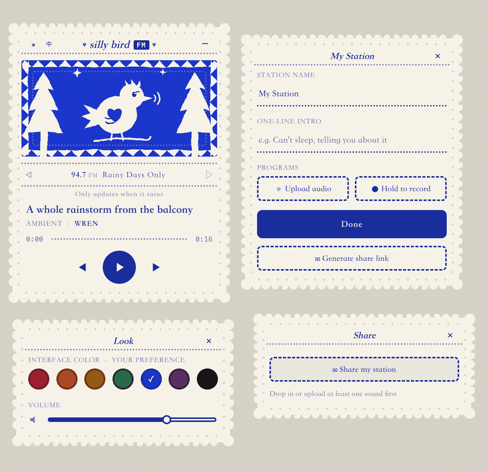

<p align="center">English · <a href="README.md">中文</a></p>

# silly bird FM

A sound radio between friends.

Low barrier to entry: like sending a voice message, everyone picks a channel name for themselves (that old-radio-dial feeling), and uploads anything sound-related — a few spoken words, a story, a hummed tune, the sound of rain — to share with friends. It's about emotional connection (hearing a friend's real, warm voice), not audio quality or production value.

A little bird perches permanently in the corner of your screen. Click it open and it's a small radio you can tune across your friends' channels — company while you vibe-code alone.

<p align="center">
  
</p>

## Look

Hans Christian Andersen's papercutting art is the only visual reference — white paper silhouettes mounted on a colored backing. The whole thing reads like a papercut that happens to make sound: scalloped paper edges, a punched-hole trim, a jagged forest against a night window, dashed seams like stitching, Chinese text set in a serif "Song" typeface. Seven mount colors (crimson / rust / ochre / forest green / blue / plum / black) are the listener's own pick — a personal preference, not something that changes with the channel.

## What works right now

- **Four draggable papercut windows**: the radio / my station (name it, write a one-line intro, upload or record) / look (color + volume) / share (generate a link); draggable with a mouse on desktop and a finger on a phone, and the bird docks to a corner of the screen when collapsed
- **Curated by design**: a station holds at most 7 tracks — picking a handful with care fits this product better than an unlimited dumping ground
- **Drop to play**: drag audio onto the bird (or upload from the panel), title / artist / cover art read automatically from ID3 tags
- **Press and hold to record**: not just uploading finished files — you can also record a moment straight from your mic
- **Nothing lost on refresh**: uploaded tracks are saved in the browser's IndexedDB, still there next time you open it
- **System media keys**: the play key on your keyboard or headset controls the bird directly (MediaSession)
- **Fully offline-capable assets**: fonts and parsing libraries are all self-hosted, zero external CDN dependency, holds up on a weak connection
- **Sharing is revocable**: sending a link isn't a one-way door — the station owner can delete the cloud content and kill an already-sent link at any time. The control stays with whoever shared it, not on an auto-destruct timer, and not gone for good the moment it's sent
- **The demo channels are original too**: the sound in the three built-in sample stations (Late Night Overthinking / Rainy Days Only / Kitchen Disco) is all synthesized on the fly from code — tones and hums, not any existing recording — same stance this product takes on sound and copyright generally
- **One-click 中/EN**: the EN / 中 button in the titlebar switches the interface language — button copy and demo-channel content follow along; a friend's own station name or track titles are never machine-translated, always left exactly as they typed them
- **Finish listening, send a stamp**: a "send a stamp" button only surfaces once you've heard every track on a friend's station — never auto-reported, only sent if you choose to, and a station can only receive one per day. The owner opens their mailbox in the Share window: each stamp is tinted in whatever color the listener happened to be using and carries nothing but a date postmark — no counts anywhere on screen

## Sharing with a friend

**Your friend doesn't need to install anything.** They open the link you sent, hit play, and they're listening — just like opening a normal webpage. No sign-up, no app, no need to know what's running underneath.

**On your end (as the station owner)**, you only need to "power it on" once: your station (the audio files plus a station.json manifest) gets uploaded to your own cloud storage. After that, every time you click **✉ Share my station** it updates the same `?listen=` link — your friend opens it and the bird tunes straight to your station and starts playing. Edit your station and click the button again, and the link you already sent updates in place — no need to send a new one. Want it back? **Revoke share** on the share card deletes the cloud content entirely and kills the link immediately — this step can't be undone.

If a friend who got your link wants to make their own station and generate their own share link, that just works too, with no extra setup on their end — everyone who opens this site runs on the same cloud config.

> Note: please only share sound you actually own the rights to (self-recorded / original / freely shareable content). Links contain an unguessable random path — only whoever has the link can listen. Sharing one public key also means there's currently no per-person permission isolation — anyone who can open this site can, in principle, write to the same storage bucket. That's a reasonable tradeoff for small friend-circle sharing, but worth knowing.

## Roadmap

1. ~~Player + papercut aesthetic~~ · ~~Real playback and persistence~~ · ~~Share links~~ (done)
2. **Real friend-testing, in progress** — already getting real feedback, still refining
3. **Going desktop** — wrapped in Tauri: always-on-top, tray icon, transparent background, launch at login
4. **Ritual layer** — a listening-receipt stamp, a weekly channel-swap day

## Running locally

Any static server works, for example:

```
npx serve . -l 5174
```

---

All rights reserved, see [LICENSE](LICENSE). Independent project, unrelated to THE 42 POST.
