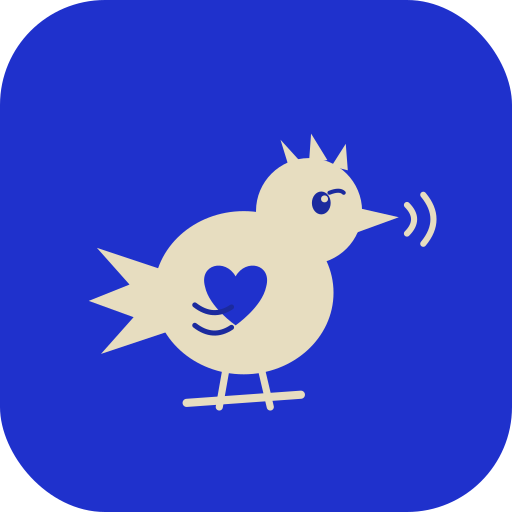
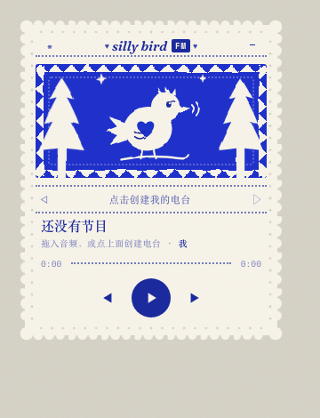
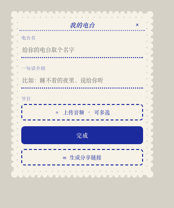
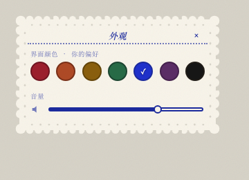

<p align="center">
  
</p>

# silly bird FM 🐦

一个朋友之间的声音电台。

低门槛：像发语音一样，人人给自己起个频道名（老电台频率的感觉），上传任何和声音有关的东西——一段话、一个故事、自己哼的歌、一场雨——分享给朋友。主打情感链接（听见朋友真实、有体温的声音），不是音质/制作。

一只常驻屏幕角落的小鸟，点开它就是一台可以在朋友的频道间来回切台的小电台，陪你 vibe-coding 时不再是一个人。

<p align="center">
  
  &nbsp;
  
  &nbsp;
  
</p>

## 视觉

安徒生的剪纸艺术是唯一的视觉参考——白纸剪影贴在彩色裱纸上。整台机器是一张会响的剪纸：扇贝剪影的纸边、打孔装饰带、锯齿森林夜窗、缝线一样的虚线分隔，中文用宋体铅字。七种裱纸色（绛红 / 赤陶 / 蜜赭 / 墨绿 / 蓝 / 梅紫 / 黑）由听的人自己选，是个人偏好，不随频道变。

## 现在就能做

- **三扇可拖动的剪纸小窗**：收音机 / 我的电台（命名 + 一句话介绍 + 上传节目）/ 外观（颜色 + 音量）；小鸟收起时停在桌面一角，点开恢复原样
- **拖入即播**：把音频拖到小鸟身上（或从面板上传），歌名 / 歌手 / 封面自动从 ID3 标签读取
- **刷新不丢**：上传的节目保存在浏览器 IndexedDB 里，下次打开还在
- **系统媒体键**：键盘播放键 / 耳机线控直接控制小鸟（MediaSession）
- **完全离线的资源**：字体与解析库全部自托管，零外部 CDN 依赖，弱网也稳

## 分享给朋友

**朋友那边什么都不用装。** 点开你发的链接，按一下播放键，就在听了——跟打开一个普通网页一样，不用注册、不用装 App、不用知道这背后是什么。

**你（电台主人）这边**只需要做一次「通电」：把你的电台（节目音频 + 一份 station.json 清单）上传到你自己的云存储，之后每次点 **✉ 生成分享链接** 都会自动产出一条 `?listen=` 链接——朋友打开，小鸟直接把你的电台调到第一频道开始放。

这份代码已经接好一个免费的 [Supabase](https://supabase.com) 项目作为云存储；如果你是拿这份代码自己重新部署一份（而不是使用已经配置好的这一份），才需要重新走一遍这五步：

1. 注册 Supabase，新建一个项目（免费档即可）
2. 左侧 **Storage** → 新建 bucket，名字填 `stations`，勾选 **Public**
3. 项目设置（Settings → API）里复制 **Project URL** 和 **anon public key**
4. 把 [`src/cloud-config.example.js`](src/cloud-config.example.js) 复制为 `src/cloud-config.js`，填入这两个值
5. 打开「我的电台」→ **✉ 生成分享链接** → 链接已自动复制，发给朋友

想先本地试试收听模式长什么样：启动本地服务后访问 `/?listen=http://localhost:5174/demo-station`（仓库自带一条测试电波）。

> 注意：请只分享自己拥有版权的声音（自录 / 原创 / 可自由传播的内容）。链接含不可猜测的随机路径，拿到链接的人才能收听。

## 路线

1. ~~播放器 + 剪纸美学~~ · ~~真实播放与持久化~~ · ~~分享链接~~（已完成）
2. **真实朋友测试** —— 把第一条链接发给一位真实朋友
3. **桌面化** —— Tauri 包装：置顶、托盘、透明背景、开机自启
4. **仪式层** —— 收听回执小邮票、每周换台日、按住录音

## 本地运行

任何静态服务器皆可，例如：

```
npx serve . -l 5174
```

---

独立项目，与 THE 42 POST 无关。
