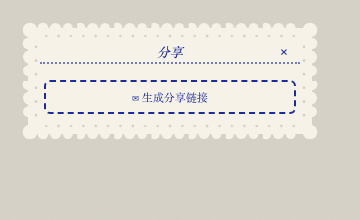

<p align="center">
  
</p>

<p align="center"><a href="README.en.md">English</a> · 中文</p>

# silly bird FM

一个朋友之间的声音电台。

低门槛：像发语音一样，人人给自己起个频道名（老电台频率的感觉），上传任何和声音有关的东西——一段话、一个故事、自己哼的歌、一场雨——分享给朋友。主打情感链接（听见朋友真实、有体温的声音），不是音质/制作。

一只常驻屏幕角落的小鸟，点开它就是一台可以在朋友的频道间来回切台的小电台，陪你 vibe-coding 时不再是一个人。

<p align="center">
  
  &nbsp;
  
  &nbsp;
  
  &nbsp;
  
</p>

## 视觉

安徒生的剪纸艺术是唯一的视觉参考——白纸剪影贴在彩色裱纸上。整台机器是一张会响的剪纸：扇贝剪影的纸边、打孔装饰带、锯齿森林夜窗、缝线一样的虚线分隔，中文用宋体铅字。七种裱纸色（绛红 / 赤陶 / 蜜赭 / 墨绿 / 蓝 / 梅紫 / 黑）由听的人自己选，是个人偏好，不随频道变。

## 现在就能做

- **四扇可拖动的剪纸小窗**：收音机 / 我的电台（命名 + 一句话介绍 + 上传或录音）/ 外观（颜色 + 音量）/ 分享（生成链接）；桌面鼠标、手机触屏都能拖动，小鸟收起时停在桌面一角，点开恢复原样
- **策展式收藏**：一个电台最多 7 首——认真挑几首，比塞成一个无限仓库更像这个产品想要的样子
- **拖入即播**：把音频拖到小鸟身上（或从面板上传），歌名 / 歌手 / 封面自动从 ID3 标签读取
- **按住录音**：不只是上传现成文件，也能直接对着麦克风录一段现场的声音
- **刷新不丢**：上传的节目保存在浏览器 IndexedDB 里，下次打开还在
- **系统媒体键**：键盘播放键 / 耳机线控直接控制小鸟（MediaSession）
- **完全离线的资源**：字体与解析库全部自托管，零外部 CDN 依赖，弱网也稳

## 分享给朋友

**朋友那边什么都不用装。** 点开你发的链接，按一下播放键，就在听了——跟打开一个普通网页一样，不用注册、不用装 App、不用知道这背后是什么。

**你（电台主人）这边**只需要做一次「通电」：把你的电台（节目音频 + 一份 station.json 清单）上传到你自己的云存储，之后每次点 **✉ 生成分享链接** 都会更新同一条 `?listen=` 链接——朋友打开，小鸟直接把你的电台调到第一频道开始放；你编辑电台之后再点一次，之前发过的旧链接会自动显示最新内容，不用重新发。

**这一点值得说清楚**：这份代码已经接好一个共享的 [Supabase](https://supabase.com) 项目作为云存储，配置就在 `src/cloud-config.js` 里，随代码一起部署——也就是说，只要是打开这个已经上线的网站（不管是你，还是收到你链接的朋友），大家的浏览器里加载到的是同一份云端配置，天然共用同一个数据库。朋友收到你的链接后，如果他们也想建一个自己的电台、生成自己的分享链接，同样不需要任何额外设置，直接就能用。

想先本地试试收听模式长什么样：启动本地服务后访问 `/?listen=http://localhost:5174/demo-station`（仓库自带一条测试电波）。

> 注意：请只分享自己拥有版权的声音（自录 / 原创 / 可自由传播的内容）。链接含不可猜测的随机路径，拿到链接的人才能收听。共用同一把公开 key 也意味着目前没有按人区分的权限隔离——谁能打开这个网站，理论上都能写入同一个存储桶。对朋友圈小范围分享影响不大，但值得知道。

## 路线

1. ~~播放器 + 剪纸美学~~ · ~~真实播放与持久化~~ · ~~分享链接~~（已完成）
2. **真实朋友测试中** —— 已经收到第一批真实反馈，持续打磨
3. **桌面化** —— Tauri 包装：置顶、托盘、透明背景、开机自启
4. **仪式层** —— 收听回执小邮票、每周换台日

## 本地运行

任何静态服务器皆可，例如：

```
npx serve . -l 5174
```

---

版权所有，详见 [LICENSE](LICENSE)。独立项目，与 THE 42 POST 无关。
