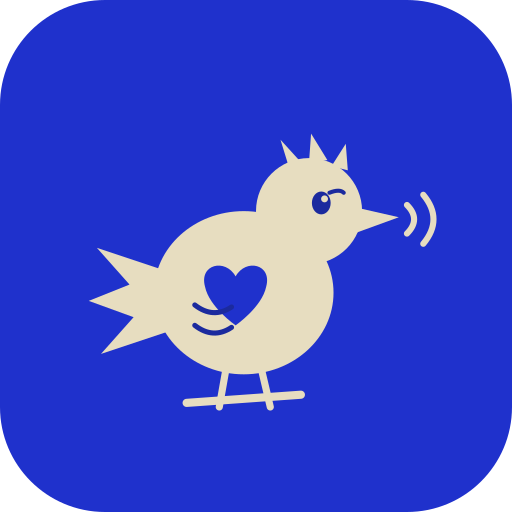
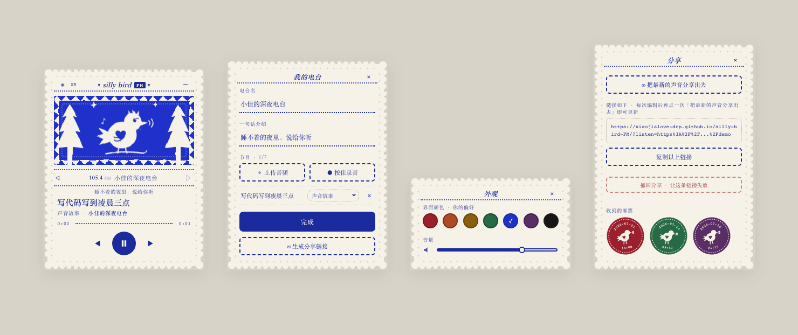

<p align="center">
  
</p>

<p align="center"><a href="README.md">English</a> · 中文</p>

<p align="center">
  <a href="https://github.com/xiaojialove-DRP/silly-bird-FM/actions/workflows/ci.yml"></a>
</p>

# silly bird FM

一个朋友之间的声音电台。

低门槛：像发语音一样，人人给自己起个频道名（老电台频率的感觉），上传任何和声音有关的东西——一段话、一个故事、自己哼的歌、一场雨——分享给朋友。主打情感链接（听见朋友真实、有体温的声音），不是音质/制作。

一只常驻屏幕角落的小鸟，点开它就是一台可以在朋友的频道间来回切台的小电台，陪你 vibe-coding 时不再是一个人。

<p align="center">
  
</p>

## 视觉

安徒生的剪纸艺术是唯一的视觉参考——白纸剪影贴在彩色裱纸上。整台机器是一张会响的剪纸：扇贝剪影的纸边、打孔装饰带、锯齿森林夜窗、缝线一样的虚线分隔，中文用宋体铅字。七种裱纸色（绛红 / 赤陶 / 蜜赭 / 墨绿 / 蓝 / 梅紫 / 黑）由听的人自己选，是个人偏好，不随频道变。

## 现在就能做

- **五扇剪纸小窗**：收音机 / 我的电台（命名 + 一句话介绍 + 上传或录音）/ 外观（颜色 + 音量）/ 分享（生成链接）/ 这是什么（点标题打开，给第一次点开陌生链接、不知道这是什么的人看的）；桌面上鼠标随意拖动摆放，手机上则像抽卡片一样按顺序滑出、自动排好，小鸟收起时停在屏幕一角，点开恢复原样
- **策展式收藏**：一个电台最多 7 首——认真挑几首，比塞成一个无限仓库更像这个产品想要的样子
- **拖入即播**：把音频拖到小鸟身上（或从面板上传），歌名 / 歌手 / 封面自动从 ID3 标签读取
- **按住录音**：不只是上传现成文件，也能直接对着麦克风录一段现场的声音
- **刷新不丢**：上传的节目保存在浏览器 IndexedDB 里，下次打开还在
- **丢了本地记录，链接能救回来**：手机存储被系统清理、或者换了新设备，回到网站粘贴自己发出去的分享链接，就能把电台（曲目、名字、简介）原样取回，不用重新上传
- **系统媒体键**：键盘播放键 / 耳机线控直接控制小鸟（MediaSession）
- **完全离线的资源**：字体与解析库全部自托管，零外部 CDN 依赖，弱网也稳
- **分享随时能撤回**：链接发出去不是有去无回——电台主人可以随时把云端内容删掉、让已经发出去的链接失效，主动权始终在分享的人手上，不是自动定时引爆，也不是永远收不回来
- **演示频道也是原创**：内置的三个示例电台（深夜胡思乱想 / 雨天限定 / 厨房迪斯科）放的声音全部是代码现场合成的音效和哼唱，不是任何现成录音，跟这个产品对声音版权的态度一致
- **一键中英文切换**：标题栏的 EN / 中 按钮切换界面语言——按钮文案、演示频道内容都会跟着换；朋友自己起的电台名、节目名不会被机器翻译，永远原样保留
- **听完了，可以寄一枚邮票**：听完朋友电台里的每一首之后，才会浮现"寄一枚邮票"——不是自动上报，只有愿意盖章的人才盖，一个电台一天最多收一枚。电台主人在「分享」窗口里打开信箱，邮票按听的人当时的裱纸颜色显色，只盖着日期，界面上不会出现任何数字
- **也能装进桌面**：一个常驻置顶的 macOS 小窗版（universal 通用包，Intel、Apple Silicon 都是原生运行，不用 Rosetta 转译），把同一个网站装进一扇去掉了多余浏览器边框的窗口；下载链接在"这是什么"面板里
- **一个安静的"有新内容"小点**：过后再打开朋友的链接，如果对方发过之后又更新过，电台名旁边会出现一个很小的标记——只在真正的回访时出现，第一次打开任何链接都不会有，看到的这一刻它就悄悄消失了

## 分享给朋友

**朋友那边什么都不用装。** 点开你发的链接，按一下播放键，就在听了——跟打开一个普通网页一样，不用注册、不用装 App、不用知道这背后是什么。

**你（电台主人）这边**只需要做一次「通电」：把你的电台（节目音频 + 一份 station.json 清单）上传到你自己的云存储，之后每次点 **✉ 把最新的声音分享出去** 都会更新同一条 `?listen=` 链接——朋友打开，小鸟直接把你的电台调到第一频道开始放；你编辑电台之后再点一次，之前发过的旧链接会自动显示最新内容，不用重新发。想收回也可以：分享卡片上的 **撤回分享** 会把云端内容整个删掉，链接立刻失效，这一步做完无法恢复。

朋友收到你的链接后，如果也想建一个自己的电台、生成自己的分享链接，同样不需要任何额外设置，直接就能用——打开这个网站的所有人用的是同一套云端配置。

> 注意：请只分享自己拥有版权的声音（自录 / 原创 / 可自由传播的内容）。链接含不可猜测的随机路径，拿到链接的人才能收听。写入（分享、撤回、寄回执）需要一个真实但匿名的浏览器身份，且只能改动自己创建的内容——打开这个网站的任何人理论上都能建立自己的电台，但改不动别人的一个字。读取则永远公开，谁都不需要身份就能听。

## 路线

1. ~~播放器 + 剪纸美学~~ · ~~真实播放与持久化~~ · ~~分享链接~~ · ~~收听回执邮票~~ · ~~从自己的分享链接恢复电台~~ · ~~给陌生访客的"这是什么"引导~~ · ~~原生桌面版~~（已完成）
2. **真实朋友测试中** —— 已经收到好几轮真实反馈，每一轮都真的改出了东西（比如朋友打不开链接时的提示、手机端交互的顺滑度），持续打磨
3. **仪式层继续** —— 每周换台日
4. **在琢磨中的"share house"** —— 一个要主动点进去的独立空间（不在首页），暗号进去后一个小圈子能互相看到大家自愿开放的声音；还只是个想法，没定开始时间

## 本地运行

任何静态服务器皆可，例如：

```
npx serve . -l 5174
```

---

版权所有，详见 [LICENSE](LICENSE)。独立项目，与 THE 42 POST 无关。
